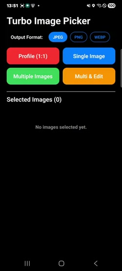
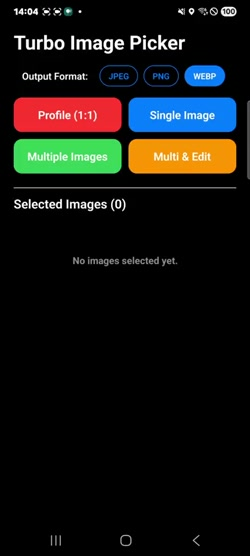
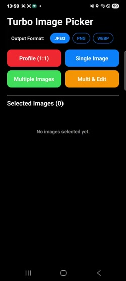

# React Native Turbo Image Picker 🚀

A highly customizable, high-performance, and purely native image picker and editor for React Native.

## ✨ Features
- **Pure Native UI**: Built with native iOS and Android for the fastest and smoothest performance.
- **Built-in Editor & Viewer**: Includes an integrated image editor (cropping, filtering) and a highly optimized image viewer.
- **Smooth Animations**: Carefully crafted interactions for a premium user experience (e.g., iOS-like smooth thumbnail centering).
- **Customizable**: Easily configure theme colors, maximum selection limits, and more.
- **New Architecture Ready**: Fully supports React Native's New Architecture (Turbo Modules).

---

## 📦 Installation

```bash
# using yarn
yarn add react-native-turbo-image-picker

# or using npm
npm install react-native-turbo-image-picker
```

If you are using iOS, don't forget to configure and install pods:

Open your ios/Podfile and add `:modular_headers => true` inside your target block:

```ruby
target 'YourAppName' do
  config = use_native_modules!
  
  # Add these two lines (이 두 줄을 추가해 주세요)
  pod 'SDWebImageWebPCoder', :modular_headers => true
  pod 'SDWebImage', :modular_headers => true
  
  # ...
end
```

Install pods with static frameworks enabled and clean your Xcode build folder:

```bash
cd ios
USE_FRAMEWORKS=static pod install
```

Note: After running pod install, please make sure to Clean Build Folder (Cmd + Shift + K) in Xcode before building the app to clear any cached module errors. (빌드 전에 Xcode에서 반드시 클린 빌드를 수행해 캐시를 삭제해 주세요.)

---

## 🛠 Usage Example

```javascript
import { RNTurboImagePicker } from 'react-native-turbo-image-picker';

// Step 1: Initialize the module (usually in App.tsx or index.js)
// Pass your license key (if you have one to remove the watermark) and default configurations
RNTurboImagePicker.init("", { 
  languageCode: 'en', 
  themeColor: '#ff0000' 
}).catch(console.error);

// Step 2: Open Image Picker
const handleOpenPicker = async () => {
  try {
    const result = await RNTurboImagePicker.openGallery({
      maxSelection: 10,
      themeColor: '#FF6B35',
      enableEditor: true,
      profileMode: false,
    });
    console.log('Selected Images:', result);
  } catch (error) {
    console.error(error);
  }
};
```

---

## 📖 API Reference

### `RNTurboImagePicker.openGallery(options?: GalleryOptions): Promise<ImageResult[]>`
Opens the native image gallery for selecting photos and videos.

**GalleryOptions (Key Properties):**
- `maxSelection` (number): Maximum number of images a user can select.
- `maxWidth` / `maxHeight` (number): Maximum dimensions to scale the image.
- `mediaType` ("photo" | "video" | "all"): Type of media to show.
- `quality` (number): Compression quality (0 to 1).
- `enableEditor` (boolean): If `true`, opens the image editor after a single image selection.
- `profileMode` (boolean): If `true`, enables a 1:1 circular crop mode for profile pictures.
- `themeColor` (string): The primary hex color for the UI (e.g., `"#FFEB3B"`).
- `autoCloseOnSelect` (boolean): Close picker automatically on single selection.
- *Also includes various text overrides for localization (e.g., `doneButtonText`, `languageCode`).*

### `RNTurboImagePicker.openEditor(options: EditorOptions): Promise<ImageResult>`
Directly opens the built-in image editor for a specific image.

**EditorOptions:**
- `uri` (string): The URI of the image to edit.
- `editedFileUri` (string, optional): Path to a previously edited version.
- `themeColor` (string): UI theme color.
- `maxWidth` / `maxHeight` (number): Maximum bounds for the edited image.

### `RNTurboImagePicker.openViewer(options: ViewerOptions): Promise<void>`
Opens a high-performance, full-screen image viewer with smooth swiping, thumbnail navigation, and pinch-to-zoom capabilities.

**ViewerOptions:**
- `images` (string[]): Array of image URIs to view.
- `initialIndex` (number): The starting index.
- `themeColor` (string): UI theme color.

### `ImageResult` (Returned Object)
When an image is selected or edited, the promise resolves to an array of `ImageResult` objects containing:
- `originalUri` / `uri`: The original and resized/edited file URIs.
- `originalWidth` / `width`: Dimensions of the image.
- `type`, `fileName`, `fileExtension`, `fileSize`: Meta information.

---

## 🎥 Demo

### Android

| Editor | Mosaic | Multi-Select |
|:---:|:---:|:---:|
| [](docs/aos_edit.mp4) | [](docs/aos_mozaic.mp4) | [](docs/aos_multi.mp4) |

### iOS

| Editor | Mosaic | Multi-Select |
|:---:|:---:|:---:|
| [](docs/ios_edit.mp4) | [](docs/ios_mozaic.mp4) | [](docs/ios_multi.mp4) |

---

## 📜 License & Contact

This `RNTurboImagePicker` library is released under the **MIT License**.
However, to remove the watermark from the image editor, a separate license purchase is required.

📧 **Contact**: [contact@usomnia.co.kr](mailto:contact@usomnia.co.kr)