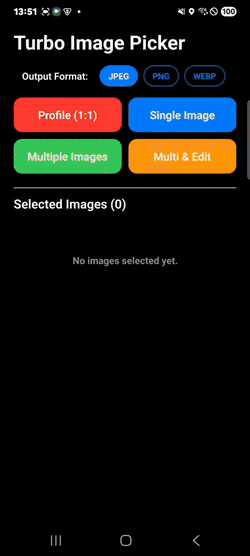
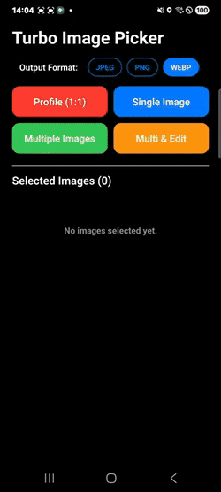
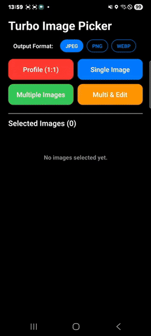
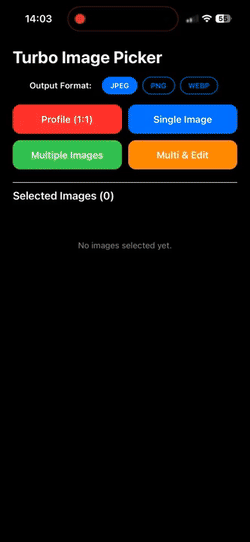
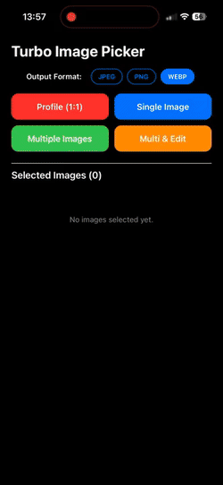

# React Native Turbo Image Picker 🚀

A highly customizable, high-performance, and purely native image picker and editor for React Native.

## ✨ Features
- **Pure Native UI**: Built with native iOS and Android for the fastest and smoothest performance.
- **Built-in Editor & Viewer**: Includes an integrated image editor (cropping, filtering) and a highly optimized image viewer.
- **Smooth Animations**: Carefully crafted interactions for a premium user experience (e.g., iOS-like smooth thumbnail centering).
- **Sticky Image Viewer**: The viewer "sticks" to the source image thumbnail with a border-radius animation, creating a seamless shared-element transition on both iOS and Android.
- **Native Mask View**: A native mask view hides the source thumbnail while the viewer is open, preventing visual duplication — no extra JS-side opacity manipulation required.
- **Android Overlay Viewer**: Option to render the viewer directly inside the host Activity's Window (no separate Activity or DialogFragment), eliminating AppState blips and enabling real-time background layout updates.
- **Customizable**: Easily configure theme colors, maximum selection limits, and more.
- **New Architecture Ready**: Fully supports React Native's New Architecture (Turbo Modules).

---

## 🎥 Demo

### Android

| Editor | Mosaic | Multi-Select |
|:---:|:---:|:---:|
|  |  |  |

### iOS

| Editor | Mosaic | Multi-Select |
|:---:|:---:|:---:|
|  |  |  |

---

## 📦 Installation

```bash
# using yarn
yarn add react-native-turbo-image-picker

# or using npm
npm install react-native-turbo-image-picker
```

If you are using iOS, run pod install:

```bash
cd ios && pod install
```

### iOS Permissions (Info.plist)
You must add the following permissions to your `ios/YourAppName/Info.plist` file, otherwise your app will crash when trying to access the camera or photo library.

```xml
<key>NSCameraUsageDescription</key>
<string>We need access to your camera to take photos and videos.</string>
<key>NSPhotoLibraryUsageDescription</key>
<string>We need access to your photo library to select images.</string>
<key>NSPhotoLibraryAddUsageDescription</key>
<string>We need access to save edited photos to your library.</string>
```

---

## 🛠 Usage Example

```javascript
import RNTurboImagePicker from 'react-native-turbo-image-picker';

// Step 1: Initialize the module (usually in App.tsx or index.js)
// Pass your license key (if you have one to remove the watermark) and default configurations
RNTurboImagePicker.init("", { 
  languageCode: 'en', 
  themeColor: '#ff0000' 
}).catch(console.error);

// Step 2: Open Image Picker
const handleOpenPicker = async () => {
  try {
    const result = await RNTurboImagePicker.openGallery({
      maxSelection: 10,
      themeColor: '#FF6B35',
      enableEditor: true,
      profileMode: false,
    });
    console.log('Selected Images:', result);
  } catch (error) {
    console.error(error);
  }
};
```

### Image Viewer with Sticky Transition (Recommended)

```javascript
import RNTurboImagePicker from 'react-native-turbo-image-picker';

// Get the on-screen position of the thumbnail to enable the sticky viewer transition
const imageRef = useRef(null);

const openViewer = () => {
  imageRef.current?.measure((x, y, width, height, pageX, pageY) => {
    RNTurboImagePicker.openViewer({
      images: ['https://example.com/photo1.jpg', 'https://example.com/photo2.jpg'],
      initialIndex: 0,
      themeColor: '#FF6B35',
      // Sticky transition: pass the thumbnail's screen coordinates
      sourceRect: { x: pageX, y: pageY, width, height },
      sourceBorderRadius: 12,
      sourceBorderCorners: ['topLeft', 'topRight', 'bottomLeft', 'bottomRight'],
      // Android: use overlay viewer to avoid AppState blips
      useOverlayViewer: true,
      onPageSelected: (index) => {
        console.log('Viewing image at index:', index);
      },
      onViewerOpened: () => {
        // Android only: called when the open animation finishes.
        // Safe place to run background scroll corrections.
        console.log('Viewer fully open');
      },
      onViewerWillClose: () => {
        console.log('Viewer is closing');
      },
    });
  });
};
```

---

## 📖 API Reference

### `RNTurboImagePicker.init(licenseKey, options?): Promise<boolean>`

Initializes the module with a license key and global defaults.

| Option | Type | Description |
|---|---|---|
| `licenseKey` | `string` | Your license key. Pass `""` for evaluation (watermark shown). |
| `options.themeColor` | `string` | Global default theme color (hex). |
| `options.languageCode` | `string` | Global default language code. |

---

### `RNTurboImagePicker.openGallery(options?): Promise<ImageResult[]>`

Opens the native image gallery for selecting photos and videos.

| Option | Type | Default | Description |
|---|---|---|---|
| `maxSelection` | `number` | `1` | Maximum number of images a user can select. |
| `maxWidth` / `maxHeight` | `number` | — | Maximum dimensions to scale the output image. |
| `mediaType` | `"photo" \| "video" \| "all"` | `"photo"` | Type of media to show. |
| `quality` | `number` | `0.8` | Compression quality (0 to 1). |
| `enableEditor` | `boolean` | `false` | Opens the image editor after a single image selection. |
| `profileMode` | `boolean` | `false` | Enables 1:1 circular crop mode for profile pictures. |
| `themeColor` | `string` | — | Primary hex color for the UI (e.g., `"#FFEB3B"`). |
| `autoCloseOnSelect` | `boolean` | `false` | Close picker automatically on single selection. |
| `asyncProcessing` | `boolean` | `false` | When `true`, image processing runs in the background and results are delivered via `onImageProcessed`. |
| `onSelectionChange` | `(event) => void` | — | Callback fired each time the selection count changes. |
| `onImageProcessed` | `(event) => void` | — | Callback fired per image when `asyncProcessing` is `true`. |
| `openDuration` / `closeDuration` | `number` | — | Override the open/close animation duration (ms). |
| `languageCode` | `string` | — | Language for the UI. Supported: `en`, `ko`, `ja`, `zh`, `fr`, `de`, `es`, `pt`, `ru`, `it`, `nl`, `pl`, `tr`, `vi`, `th`, `id`, `ms`, `hi`, `da`. |
| `doneButtonText` / `allItemsText` / `selectedItemsText` / `recentsAlbumText` | `string` | — | Text overrides for specific UI labels. |

---

### `RNTurboImagePicker.openEditor(options): Promise<ImageResult>`

Directly opens the built-in image editor for a specific image.

| Option | Type | Description |
|---|---|---|
| `uri` | `string` | The URI of the image to edit (`originalUri` from a picker result). |
| `editedFileUri` | `string` | (Optional) Path to a previously edited version to resume editing from. |
| `themeColor` | `string` | UI theme color. |
| `maxWidth` / `maxHeight` | `number` | Maximum bounds for the edited image output. |
| `openDuration` / `closeDuration` | `number` | Override the open/close animation duration (ms). |

---

### `RNTurboImagePicker.openViewer(options): Promise<void>`

Opens a high-performance, full-screen image viewer with smooth swiping, thumbnail navigation, and pinch-to-zoom capabilities.

#### Basic Options

| Option | Type | Default | Description |
|---|---|---|---|
| `images` | `string[]` | **required** | Array of image URIs to display. |
| `placeholderImages` | `string[]` | — | Low-resolution placeholder URIs shown while the full image loads. |
| `initialIndex` | `number` | `0` | The index of the image to show first. |
| `themeColor` | `string` | — | UI theme color (counter badge, thumbnails). |
| `title` | `string` | — | Title text shown in the viewer toolbar. |
| `openDuration` / `closeDuration` | `number` | — | Override the open/close animation duration (ms). |

#### Sticky Viewer / Shared-Element Transition Options

These options enable a smooth "shared-element"-style transition where the viewer zooms out from (and back into) the source thumbnail.

| Option | Type | Description |
|---|---|---|
| `sourceRect` | `SourceRect` | Screen coordinates (`x`, `y`, `width`, `height`) of the source thumbnail. Obtain via `ref.measure(...)`. Enables the zoom-from-thumbnail open animation. |
| `sourceBorderRadius` | `number` | Border radius of the source thumbnail. The viewer animates from this radius to 0 (and back on close), creating a seamless shape transition. |
| `sourceBorderCorners` | `('topLeft' \| 'topRight' \| 'bottomLeft' \| 'bottomRight')[]` | Specifies which corners of the source thumbnail have the border radius. Useful for images with a radius only on specific corners (e.g., chat bubbles). |
| `sourceBackgroundColor` | `string` | Background color behind the source thumbnail (used to match the background during the open animation). |
| `hideSourceImage` | `boolean` | When `true`, the native mask view hides the source thumbnail while the viewer is open, preventing visual duplication. The mask is automatically removed when the viewer closes. |

#### Callbacks / Event Options

| Option | Type | Platform | Description |
|---|---|---|---|
| `onPageSelected` | `(index: number) => void` | Both | Called whenever the user swipes to a different image. |
| `onViewerWillClose` | `() => void` | Both | Called just before the viewer begins its close animation. |
| `onViewerOpened` | `() => void` | Android | Called once when the open animation finishes. Ideal for triggering background scroll corrections, since the viewer fully covers the screen at this point — no race conditions. |

#### Android Viewer Mode Options

On Android, the viewer can be opened in three different modes. Choose based on your app's requirements:

| Option | Type | Default | Description |
|---|---|---|---|
| `useDialogViewer` | `boolean` | `false` | Opens the viewer as a **DialogFragment** (full-screen dialog) instead of a separate Activity. Prevents the RN host Activity from pausing (`onPause`), which otherwise causes `AppState` to briefly report `"background"` and temporarily freezes RN UI interaction. **Limitation:** The DialogFragment still uses a separate Android Window, so background RN view updates (e.g., list scroll corrections) may not render to screen until the viewer closes. |
| `useOverlayViewer` | `boolean` | `false` | ⭐ **Recommended for Android.** Opens the viewer as a `View` added directly on top of the host Activity's existing Window — no separate Activity or Dialog Window. **Benefits:** AppState never flickers, background RN layout changes (e.g., scroll corrections for the sticky viewer) are reflected in real time (same render tree, same frame). **Note:** When both `useDialogViewer` and `useOverlayViewer` are `true`, `useOverlayViewer` takes priority. |

> **Android Viewer Mode Summary:**
> - Default (no flag): Separate Activity — `AppState` blips, but most stable.
> - `useDialogViewer: true`: DialogFragment — no `AppState` blip, but background layout updates may be deferred.
> - `useOverlayViewer: true`: Overlay View — no `AppState` blip, background layout updates work in real time. ✅

---

### `RNTurboImagePicker.updateSourceRect(rect): Promise<void>`

Updates the source thumbnail coordinates while the viewer is open. Call this inside `onPageSelected` after measuring the newly selected thumbnail's position, so the close animation correctly animates back to the right thumbnail.

```typescript
onPageSelected: async (index) => {
  const rect = await measureThumbnail(index); // your measurement logic
  if (rect) {
    RNTurboImagePicker.updateSourceRect(rect);
  }
}
```

---

### `RNTurboImagePicker.closeGallery(): Promise<boolean>`

Programmatically closes the gallery picker. Returns `true` if it was open and is now closed.

---

### `RNTurboImagePicker.addSelectionChangeListener(listener): () => void`

Subscribes to selection change events outside of `openGallery`. Returns an unsubscribe function.

```typescript
const unsubscribe = RNTurboImagePicker.addSelectionChangeListener((event) => {
  console.log(`${event.selectedCount} / ${event.maxSelection} selected`);
});

// Later, when done:
unsubscribe();
```

---

### `RNTurboImagePicker.getDefaultAnimationConfig(): Promise<AnimationConfig>`

Returns the native default animation durations (in ms) for all transitions. Useful for synchronizing JS animations.

```typescript
const config = await RNTurboImagePicker.getDefaultAnimationConfig();
// { galleryOpen, galleryClose, editorOpen, editorClose, viewerOpen, viewerClose }
```

---

### `RNTurboImagePicker.injectImageCache(url, localPath): Promise<boolean>`

Pre-populates the native image cache (SDWebImage on iOS, Glide on Android) with a local file for a given remote URL. This lets the viewer display the image instantly from disk without a network request.

```typescript
await RNTurboImagePicker.injectImageCache(
  'https://example.com/photo.jpg',
  '/path/to/cached/photo.jpg'
);
```

---

### `ImageResult` (Returned Object)

When an image is selected or edited, the promise resolves to an array of `ImageResult` objects:

| Field | Type | Description |
|---|---|---|
| `originalUri` | `string` | URI of the original asset (`ph://` or `file://`). |
| `originalFileUri` | `string` | File URI of the original-resolution image (`file://`). |
| `originalWidth` / `originalHeight` | `number` | Dimensions of the original asset. |
| `uri` | `string` | URI of the resized/edited output image (`file://`). |
| `width` / `height` | `number` | Dimensions of the output image. |
| `type` | `string` | MIME type (e.g., `"image/jpeg"`). |
| `caption` | `string` | Caption text entered in the editor (if any). |
| `fileName` | `string` | File name of the output image. |
| `fileExtension` | `string` | File extension (e.g., `"jpg"`). |
| `fileSize` | `number` | File size in bytes. |

---

### `SourceRect`

```typescript
interface SourceRect {
  x: number;      // Screen X coordinate of the thumbnail
  y: number;      // Screen Y coordinate of the thumbnail
  width: number;  // Thumbnail width
  height: number; // Thumbnail height
}
```

---

## 📜 License & Contact

This `RNTurboImagePicker` library is released under the **MIT License**.

📧 **Contact**: [contact@usomnia.co.kr](mailto:contact@usomnia.co.kr)